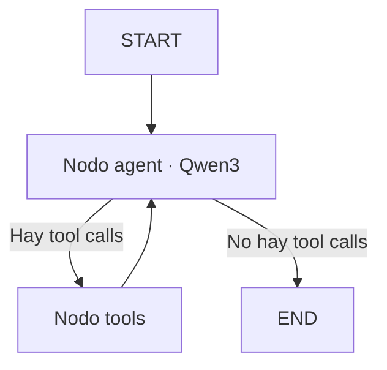

# LangGraph Task Agent

Agente local de gestión de tareas construido con **Python**, **LangChain**, **LangGraph** y **Ollama**. El proyecto muestra, de forma progresiva, cómo pasar de una llamada simple a un LLM a un ciclo agéntico basado en grafos y capaz de seleccionar y ejecutar herramientas.

El objetivo principal es didáctico: comprender qué partes pertenecen al modelo, cuáles controla la aplicación y cómo LangGraph coordina el estado, los nodos, las aristas y las llamadas a herramientas.

## Funcionalidades

El agente dispone de tres herramientas:

- Crear una tarea.
- Listar las tareas existentes.
- Marcar una tarea como completada.

El modelo interpreta la petición del usuario y decide qué herramienta utilizar. La aplicación conserva el control de la ejecución y devuelve el resultado de la herramienta al modelo para que genere una respuesta final fundamentada en el resultado real.

## Arquitectura



El ciclo de ejecución es el siguiente:

1. El usuario envía una solicitud.
2. El nodo `agent` proporciona al modelo el historial y los esquemas de las herramientas.
3. El modelo puede responder directamente o solicitar una herramienta mediante *tool calling*.
4. `tools_condition` decide si la ejecución debe continuar hacia `ToolNode` o finalizar.
5. `ToolNode` ejecuta la función seleccionada y añade un `ToolMessage` con el resultado.
6. El flujo vuelve al nodo `agent`.
7. El ciclo termina cuando el modelo responde sin solicitar nuevas herramientas.

## Tecnologías

- Python 3.10 o superior.
- LangChain.
- LangGraph.
- `langchain-ollama`.
- Ollama.
- Qwen3 8B.

Todo el modelo se ejecuta localmente mediante Ollama, por lo que el proyecto no necesita una clave de API externa.

## Estructura del proyecto

```text
task-agent/
├── graph_agent.py          # Implementación final mediante LangGraph
├── manual_agent.py         # Ciclo agéntico implementado manualmente
├── model_test.py           # Prueba básica de conexión con Ollama
├── tool_calling_test.py    # Prueba de selección de herramientas
├── tools.py                # Herramientas y almacén en memoria
├── tools_test.py           # Pruebas directas de las herramientas
└── README.md
```

Los archivos representan etapas progresivas del aprendizaje. `manual_agent.py` permite observar explícitamente el ciclo modelo-herramienta-modelo antes de delegar su orquestación en LangGraph.

## Instalación

### 1. Clonar el repositorio

```bash
git clone <URL_DEL_REPOSITORIO>
cd task-agent
```

### 2. Crear un entorno virtual

```bash
python3 -m venv .venv
source .venv/bin/activate
```

En Windows:

```powershell
.venv\Scripts\activate
```

### 3. Instalar las dependencias

```bash
python -m pip install --upgrade pip
pip install -r requirements.txt
```

### 4. Preparar Ollama

Instala [Ollama](https://ollama.com/) y descarga el modelo:

```bash
ollama pull qwen3:8b
```

Comprueba que esté disponible:

```bash
ollama ls
```

## Ejecución

Ejecuta la versión basada en LangGraph:

```bash
python graph_agent.py
```

## Pruebas por capas

El proyecto permite comprobar cada capa por separado:

```bash
# Conexión entre LangChain y Ollama
python model_test.py

# Herramientas deterministas sin utilizar el LLM
python tools_test.py

# Capacidad del modelo para seleccionar herramientas
python tool_calling_test.py

# Ciclo agéntico implementado explícitamente
python manual_agent.py

# Orquestación mediante LangGraph
python graph_agent.py
```

## Autor

**Jaime Bielza**
Ingeniero de telecomunicaciones.  
Doctorando en Quantum Machine Learning @UAM bajo dirección de Elias Combarro.  
Senior AI Engenieer.  
Investigador independiente || Divulgador científico: @AIrQuantumLab.  
Contacto: jbielzapoza@gmail.com.  